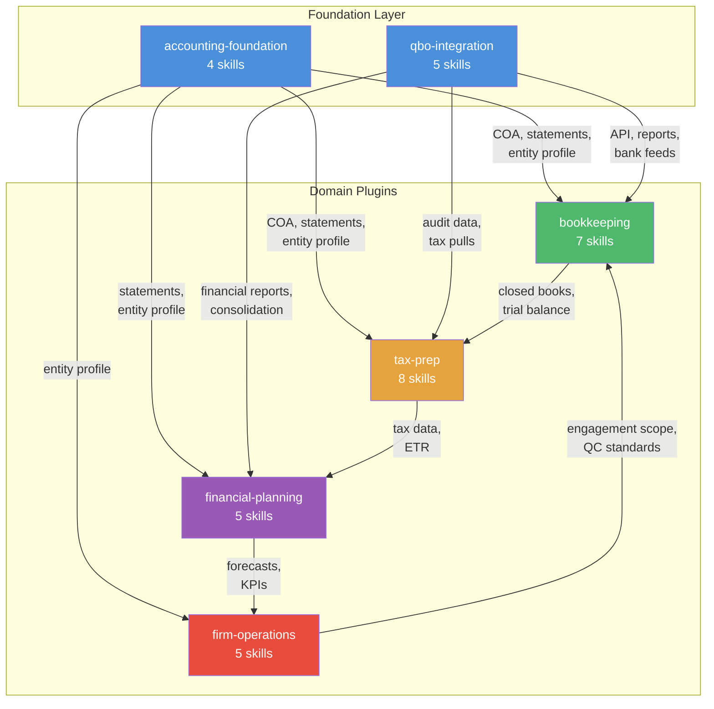
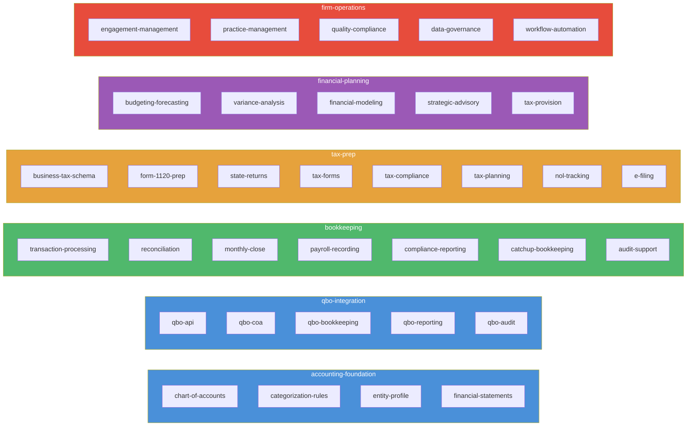

# AEO Basis Plugin Marketplace

An open-source knowledge base for accounting firms, packaged as a [Claude Code](https://docs.anthropic.com/en/docs/claude-code) plugin marketplace. Six plugins deliver 34 specialized skills across bookkeeping, tax preparation, financial planning, and firm operations — all tuned for C-corporation engagements on US GAAP.

Every skill is backed by curated reference material (124 articles, 32,000+ lines of source content) synthesized into operational decision logic, procedures, and rules that Claude can apply in real time during client work.

## What This Does

Install one or more plugins into Claude Code and your AI assistant gains deep, practical knowledge of accounting workflows:

- **Draft a Form 1120** and Claude walks through GL-to-return line mapping, book-tax differences with IRC citations, and Schedule M-1 reconciliation
- **Reconcile bank accounts** and Claude follows an 11-step procedure with error heuristics (divisible-by-9 transposition detection, divisible-by-2 reversal detection)
- **Build a 13-week cash flow model** and Claude structures the projection with AR collection assumptions, AP payment timing, and working capital dynamics
- **Respond to an IRS notice** and Claude triages by notice type, identifies response deadlines, and outlines the resolution path with authority citations

This is not generic accounting knowledge — it is synthesized operational content with specific procedures, formulas, thresholds, and decision trees drawn from authoritative sources.

## Plugin Architecture

The marketplace is organized into layers. Foundation and platform plugins provide shared knowledge that domain plugins build on through runtime skill invocation.



### Platform Swappability

`qbo-integration` is a separate plugin — not embedded in domain skills. Domain plugins reference the accounting system generically and delegate platform-specific execution to `qbo-integration` through cross-plugin skill invocation. A future Xero or Sage integration would be an additional plugin, not a modification to existing ones.

### Skill Map

Each plugin contains self-contained skills with bundled reference material. Skills communicate across plugins through runtime invocation — no file-path dependencies.



## Plugins

### accounting-foundation — Cross-cutting GAAP knowledge

Always loaded. Provides shared accounting fundamentals that every service line needs.

- **chart-of-accounts** — COA design, account types, numbering conventions, Form 1120 tax-line mapping
- **categorization-rules** — Transaction classification, vendor-to-GL mapping, CapEx vs OpEx, bank feed rule logic
- **entity-profile** — Entity type, EIN, ownership structure, officers, foreign ownership, state filing obligations
- **financial-statements** — Balance sheet, P&L, cash flow, ratio analysis, year-end close, GAAP presentation

### qbo-integration — QuickBooks Online platform layer (swappable)

Platform-specific execution for QBO. Domain plugins delegate here for accounting system operations.

- **qbo-api** — OAuth 2.0, REST/GraphQL API, batch operations, error codes, rate limiting, attachments
- **qbo-coa** — Account type/detail type selection, tax-line mapping, special account behavior, JE import
- **qbo-bookkeeping** — Catch-up bookkeeping in QBO, multi-year reconstruction, OBE cleanup, period locking
- **qbo-reporting** — Financial reports, consolidation, intercompany elimination, investment accounting, Excel export
- **qbo-audit** — Trial balance extraction, audit adjustment posting, Form 1120 data mapping, materiality evaluation

### bookkeeping — Transaction processing through close

Full bookkeeping lifecycle from daily transaction entry through audit-ready workpapers.

- **transaction-processing** — Bank feeds, auto-matching, rule engine, receipt capture, OCR, duplicate handling
- **reconciliation** — Bank, credit card, and investment account reconciliation with error heuristics
- **monthly-close** — Five-phase close sequence, accruals, depreciation, ASC 842 leases, ASC 606 revenue
- **payroll-recording** — Payroll journal entries from external providers, liability reconciliation to 941/940
- **compliance-reporting** — 1099 compliance (NEC/MISC/INT/DIV), sales/use tax, nexus analysis
- **catchup-bookkeeping** — Multi-year catch-up planning, summary vs detailed entry strategy, validation
- **audit-support** — Lead schedules, PBC lists, AJE/RJE posting, SSARS compilation/review

### tax-prep — Federal and state tax compliance

Form 1120, Florida F-1120, supporting schedules, planning, and IRS correspondence.

- **business-tax-schema** — Form line mappings across tax years 2007-2025, revision topology, era routing
- **form-1120-prep** — GL-to-return mapping, book-tax differences, Schedule M-1/M-3, deduction analysis
- **state-returns** — Nexus analysis, apportionment, Florida F-1120, state modifications, state e-filing
- **tax-forms** — Depreciation (4562), capital gains (8949/Schedule D), FTC (1118), Form 5472, digital assets
- **tax-compliance** — Deadlines, extensions (7004), estimated payments, amended returns, IRS notice response, collections
- **tax-planning** — Year-end strategies, entity selection, officer compensation, AET, R&D credit, worker classification
- **nol-tracking** — NOL computation, carryback/carryforward rules by era, Section 382 limitations, utilization waterfall
- **e-filing** — MeF transmission, rejection code resolution, EFIN credentials, Form 8879-CORP, mandatory e-file thresholds

### financial-planning — Forward-looking analysis and advisory

Budgeting, modeling, and strategic advisory built on bookkeeping data.

- **budgeting-forecasting** — Annual budgets, rolling forecasts, 13-week cash flow, budget governance, working capital
- **variance-analysis** — Budget-vs-actual decomposition, KPI dashboards, industry benchmarking, management reporting
- **financial-modeling** — Three-statement models, scenario/sensitivity analysis, covenant modeling, consolidation
- **strategic-advisory** — M&A due diligence, succession planning, compensation benchmarking, insurance adequacy
- **tax-provision** — ASC 740 current/deferred tax, DTA/DTL measurement, valuation allowance, ETR reconciliation

### firm-operations — Internal practice management

Running the firm: engagements, quality, compliance, and automation.

- **engagement-management** — Engagement letters, client onboarding, billing/pricing models, client communications
- **practice-management** — Workflow orchestration, deadline tracking, staff assignment, capacity planning
- **quality-compliance** — SQMS No. 1, peer review, CPE compliance, state board regulation, E&O liability
- **data-governance** — WISP, document retention, PII handling, breach response, secure file management
- **workflow-automation** — Event-driven triggers, recurring tasks, bank feed rules, reporting automation, staff training

## Installation

First, add the marketplace. Then install the plugins you need.

```bash
# Add the marketplace (from shell)
claude plugin marketplace add AeyeOps/aeo-basis-plugin-marketplace

# Install individual plugins
claude plugin install accounting-foundation@aeo-basis-plugin-marketplace
claude plugin install qbo-integration@aeo-basis-plugin-marketplace
claude plugin install bookkeeping@aeo-basis-plugin-marketplace
claude plugin install tax-prep@aeo-basis-plugin-marketplace
claude plugin install financial-planning@aeo-basis-plugin-marketplace
claude plugin install firm-operations@aeo-basis-plugin-marketplace
```

Or from inside a Claude Code session, use `/plugin marketplace add` and `/plugin install` with the same arguments.

Install the plugins relevant to your practice. A bookkeeping-focused firm might start with `accounting-foundation`, `qbo-integration`, and `bookkeeping`. A full-service firm can install all six.

## Use Cases

### Solo Practitioner — Tax Season Workflow

A one-person tax practice installs `accounting-foundation`, `qbo-integration`, and `tax-prep`. During return preparation, Claude helps with:

- Pulling trial balance data and mapping GL accounts to Form 1120 lines
- Identifying book-tax differences (Section 179, bonus depreciation, meals disallowance) with current-year limits
- Computing estimated tax safe harbor and recommending extension strategy based on available information
- Drafting IRS notice responses with the correct form, deadline, and penalty abatement strategy
- Tracking NOL carryforwards across tax years with Section 382 limitation awareness

### Growing Firm — Full-Service Advisory

A mid-size firm installs all six plugins. Beyond tax and bookkeeping, the team uses Claude for:

- Building 13-week cash flow projections with working capital dynamics (DSO/DIO/DPO analysis)
- Running budget-vs-actual variance analysis with decomposition into price, volume, and mix drivers
- Benchmarking client financials against industry data with quartile positioning and narrative translation
- Preparing M&A due diligence checklists, quality-of-earnings adjustments, and working capital normalization
- Managing engagement letters with scope-specific language, billing model selection, and collection escalation
- Tracking CPE compliance against state board biennial requirements and NASBA credit rules

### Catch-Up Engagement

A firm onboards a new client with two years of unreconciled books. With `bookkeeping` and `qbo-integration` installed, Claude guides:

- Source document triage and current-state assessment
- Entry strategy decision (summary vs. detailed vs. hybrid based on the 2-year threshold)
- Opening balance setup and OBE cleanup
- Monthly summary journal entry construction with reconciliation at each stage
- Quality gates before advancing to tax preparation

## How Skills Work

Each skill follows a progressive disclosure pattern:

1. **Description** (~400 characters) — always in Claude's context; determines when the skill activates
2. **SKILL.md body** (~200-400 lines) — loaded when the skill triggers; contains synthesized operational content (decision logic, procedures, formulas, rules)
3. **Reference files** — loaded on demand for deep detail (full IRC citations, step-by-step procedures, data model specifications, form instructions)

Skills are designed so that most questions can be answered from the SKILL.md body alone. Reference files provide the deep-dive backup for specific lookups, edge cases, and authoritative citations.

### Cross-Plugin Communication

Plugins are file-isolated (each copied to cache independently). Cross-plugin sharing works through runtime visibility, not file imports:

- **Skills** from all loaded plugins appear in the same session. A tax skill can say "invoke `qbo-integration:qbo-api` for API patterns" and Claude loads it
- **MCP servers** from any plugin are globally visible
- **Hooks** from all plugins merge — event handlers fire regardless of which plugin defined them
- **File references** (`@path/to/file`) only work within the same plugin — cross-plugin `@` imports fail silently

When knowledge is relevant to multiple service lines, the consuming skill invokes the owning skill by name — never references internal files. Prefer runtime skill invocation over file duplication.

## Repository Structure

```
aeo-basis-plugin-marketplace/
├── .claude-plugin/
│   └── marketplace.json          # Plugin registry
├── plugins/
│   ├── accounting-foundation/    # 4 skills, 18 reference files
│   ├── qbo-integration/          # 5 skills, 26 reference files
│   ├── bookkeeping/              # 7 skills, 18 reference files
│   ├── tax-prep/                 # 8 skills, 38 reference files
│   ├── financial-planning/       # 5 skills, 13 reference files
│   └── firm-operations/          # 5 skills, 14 reference files
├── CHANGELOG.md
└── README.md
```

Each skill directory contains:

```
skill-name/
├── SKILL.md           # Synthesized operational content
└── references/        # Source knowledge base articles
    ├── topic-a.md
    └── topic-b.md
```

## Contributing

Contributions welcome. Key guidelines:

- **SKILL.md files** should be synthesized from reference material, not written from general knowledge
- **Descriptions** follow the pattern: "Contains verified [2-3 artifacts]... [domain keywords]. Consult when [trigger scenarios]."
- **Content must be platform-neutral** — domain plugins reference "the accounting system" generically and delegate platform-specific execution to `qbo-integration` skills
- **Cross-plugin references** use `plugin-name:skill-name` format — never reference another plugin's internal files
- **Reference files** are the source of truth; SKILL.md content is derived from them

## License

MIT
